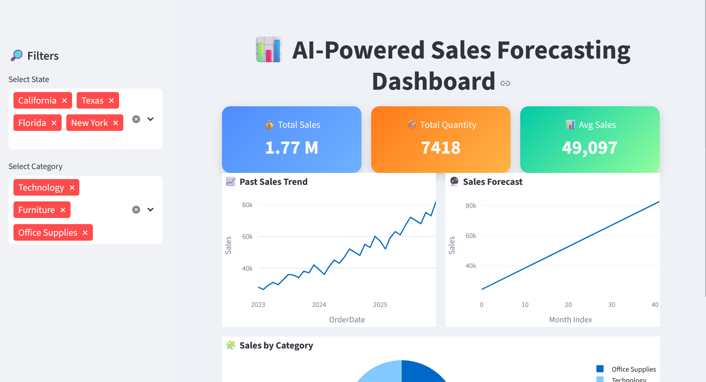
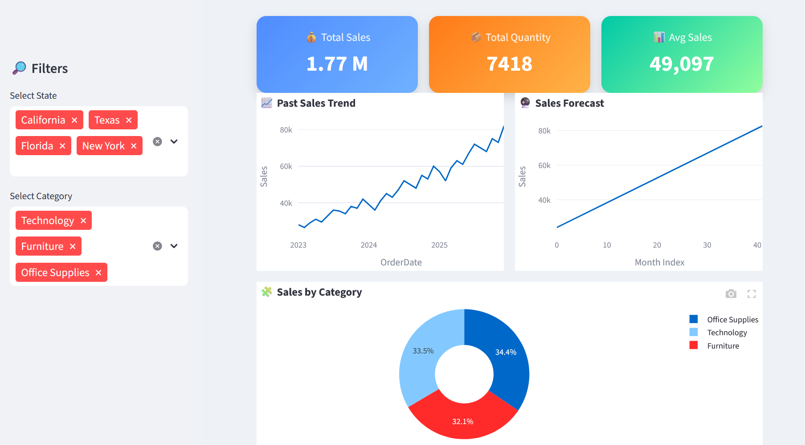

# AI Sales Forecasting Dashboard

This project is developed as part of the **Future Interns Machine
Learning Internship -- Task 1**. It provides an **interactive analytics
dashboard** that analyzes historical retail sales data and forecasts
future sales using a machine learning model.

------------------------------------------------------------------------

# Objective

The objective of this project is to:

-   Analyze historical sales data
-   Identify trends and patterns in retail sales
-   Forecast future sales using a machine learning model
-   Provide business insights through an interactive dashboard

------------------------------------------------------------------------

# Tools & Technologies

## Programming Language

-   Python

## Libraries

-   Pandas
-   NumPy
-   Scikit-learn
-   Plotly
-   Streamlit

## Machine Learning Model

-   Linear Regression

------------------------------------------------------------------------

# Dataset

The dataset contains historical **retail sales records** including:

-   Order Date
-   State
-   Category
-   Sales
-   Quantity

The data is processed and **aggregated monthly** to perform time-series
sales forecasting.

------------------------------------------------------------------------

# Key Features

## Interactive Filters

Users can dynamically filter the data using:

-   State
-   Product Category

## Sales KPI Metrics

The dashboard displays key performance indicators:

-   Total Sales
-   Total Quantity Sold
-   Average Sales

## Monthly Sales Trend

A line chart visualizes **historical monthly sales trends** to help
understand business performance over time.

## AI-Based Sales Forecasting

A **Linear Regression model** is trained on historical sales data to
forecast future sales trends.

Users can select the **number of months to forecast (3--12 months)**
using a slider.

## Model Evaluation

The model performance is evaluated using:

-   MAE (Mean Absolute Error)
-   RMSE (Root Mean Squared Error)
-   R² Score

These metrics help measure how accurately the model predicts sales.

## Sales Insights

Additional visualizations include:

-   **Sales Distribution by Category** (Pie Chart)
-   **Sales by State** (Bar Chart)

These insights help businesses understand which categories and locations
perform best.

------------------------------------------------------------------------

# Dashboard Output

The dashboard provides a **scrollable interactive interface** that
allows users to:

-   Analyze historical sales
-   Explore regional performance
-   Understand category contributions
-   Predict future sales trends

------------------------------------------------------------------------

# Dashboard Screenshots

### Dashboard View 1

### Dashboard View 2

------------------------------------------------------------------------

# Result

The machine learning model successfully identifies **sales trends and
predicts future sales patterns**. The dashboard presents these insights
visually, helping businesses make **data-driven decisions for sales
planning and strategy**.

------------------------------------------------------------------------

# Project Status

Task 1 Completed\
Future Interns Machine Learning Internship

